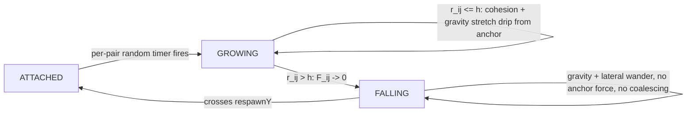

# Lava Demo

Implementation: raw WebGPU, plain ES modules, no bundler, static file server. No Three.js, no npm dependencies.

## Overview
1. [Rendering](#1-rendering)
   1. [Data Model](#11-data-model-simulationdropstatejs)
   2. [Render Passes](#12-render-passes)
   3. [Metaball Surface](#13-metaball-surface)
   4. [Noise](#14-noise)
   5. [Shading](#15-shading)
   6. [Camera](#16-camera)
   7. [Core Plumbing](#17-core-plumbing)
2. [Physics](#2-physics)
   1. [Data Model](#21-data-model-dripstate)
   2. [Forces](#22-forces)
   3. [Phases](#23-phases)
   4. [Integration](#24-integration)
   5. [Derived Quantities & Tuning](#25-derived-quantities--tuning)

---

## 1. Rendering

### 1.1 Data Model (`simulation/dropState.js`)
- flat array of **drops**, 32-byte record each, plain GPU storage buffer, ping-ponged (ABA swap, no textures) between `'dropStateA'` / `'dropStateB'`
- record per drop $i$: position $\mathbf{x}_i$ + radius $r_i$ (vec4), velocity $\mathbf{v}_i$ + cached speed $\|\mathbf{v}_i\|$ (vec4)
- `dropCount` fixed at startup — static pool, no runtime merge/split/spawn; appearance/disappearance = a drop moving to/from an off-screen or coincident position
- mass not stored — computed per-body from radius, shared by physics and the rendering density field ([§1.3](#13-metaball-surface)):

$$m_i = \frac{4}{3}\pi r_i^3\,\rho_0 \qquad (\rho_0 = \text{fluidDensity})$$

- API: `makeDropState(device, registry, dropCount) -> { registry, dropCount, activeIndex }`; `getCurrentDropBuffer`/`getNextDropBuffer` pick A/B by `activeIndex`; `swapDropState` flips it once per substep
- $\text{dropCount} = 2\cdot\text{ballCount}$ (an anchor + a drip per pair, [§2.1](#21-data-model-dripstate))
- initial seeding (buffer A only): `ballCount` positions evenly spaced across `lineSpanWidth` $W_L$ ([§1.6](#16-camera)) at the top of frame,

$$x_i = -\frac{W_L}{2} + \frac{i}{\text{ballCount}-1}\,W_L, \quad i = 0,\dots,\text{ballCount}-1$$

  each seeds one coincident anchor+drip pair there, radius = drop radius ([§2.5](#25-derived-quantities--tuning)), velocity $\mathbf 0$, phase `ATTACHED`. (Supersedes any generic scattered-pool seeding — this is a line/pair layout, [§2.1](#21-data-model-dripstate).)

### 1.2 Render Passes
- two full-screen passes per frame (`rendering/renderingSystem.js`), each an oversized fullscreen triangle, no vertex/index buffers
- **raymarch pass**: renders into an `rgba16float` offscreen texture; alpha 0 = miss/background, 1.0 = hit
- **post-process pass**: bloom + Reinhard tonemap + exposure → canvas, with bright-pass threshold $\tau$, bloom intensity $I$, exposure $E$ (defaults $\tau=1.0$, $I=0.6$, $E=1.5$), 8-tap box blur:

$$B(\mathbf{p}) = \max(C(\mathbf p) - \tau,\ 0), \qquad C'(\mathbf p) = \big(C(\mathbf p) + I\cdot\overline{B}(\mathbf p)\big)\cdot E, \qquad T(\mathbf p) = \frac{C'(\mathbf p)}{1+C'(\mathbf p)}$$

  background bypass: if $\alpha(\mathbf p) < 0.5$, output $C(\mathbf p)$ directly, skipping bloom/tonemap

### 1.3 Metaball Surface
- **surface = isosurface of the same density field that drives physics**, evaluated live from the drop buffer every ray step — no hand-authored SDF, no baked texture:

$$A(\mathbf x) = \sum_j m_j\,W_{\text{density}}(\mathbf x - \mathbf x_j,\, h), \qquad \text{surface} = \{\mathbf x : A(\mathbf x) = \text{isoLevel}\}$$

  ($A$ rising toward each particle center; outside the fluid $A(\mathbf x) < \text{isoLevel}$)
- each particle evaluated in a **locally stretched frame** along velocity (world-down fallback near-stationary) so fast drops read elongated — rendering-only anisotropy; physics ([§2.2](#22-forces)) evaluates $W_{\text{density}}$ isotropically:

$$\text{stretchAmount} = \operatorname{clamp}(\|\mathbf v\|\cdot k_{\text{stretch}},\ 0,\ \text{maxStretch}), \qquad h_\parallel = h(1+\text{stretchAmount}), \quad h_\perp = \frac{h}{\sqrt{1+\text{stretchAmount}}}$$

- **`isoLevel` calibrated against a single particle's own peak density, not bulk rest density** — this scene is sparse (pairs on a line, never a packed fluid), so a bulk-SPH assumption doesn't hold:

$$\text{isoLevel} = C\cdot m\cdot W_{\text{density}}(0,h), \qquad C\in[0.3,0.6],\ C\approx0.35 \text{ (defensive, see below)}$$

  a lone drop still crosses `isoLevel` on its own; an ATTACHED/GROWING pair's overlapping contributions read comfortably above it as one fused blob. Bias $C$ low, not centered: as a neck approaches $r\to h$, the midpoint density drops toward `isoLevel` *before* $\mathbf F_{ij}$ actually reaches zero — a high $C$ tears the visual bridge open early, reading as a delayed double-take instead of one clean snap.
- **$A$ is not a true distance field** — tracing uses a gradient-based conservative step instead of sphere tracing:

$$\Delta s(\mathbf x) = \operatorname{clamp}\!\left(\frac{|A(\mathbf x)-\text{isoLevel}|}{|\nabla A|_{\max}},\ \text{minStep},\ \text{maxStep}\right)$$

$$|\nabla W_{\text{density}}|_{\max} \approx \frac{2.7}{h^4}\ \text{(peak slope of one poly6 lobe, at } r=h/\sqrt5\text{)}, \qquad |\nabla A|_{\max} \approx N_{\text{local}}\cdot m\cdot|\nabla W_{\text{density}}|_{\max}$$

  $N_{\text{local}}\approx4$ (small local count — never densely packed), $\text{minStep}=0.02h$, $\text{maxStep}=0.5h$; ray start/end clipped against the raymarch trace-bound box first (slab method)
- **hit test: sign-change + bisection, not a fixed epsilon.** $A(\mathbf x) - \text{isoLevel}$ is in raw density units (tens to hundreds), not the SDF-scale a fixed `surfaceEpsilon` assumes. Advance by $\Delta s$ until $\operatorname{sign}(A-\text{isoLevel})$ flips, then bisect (~4–6 iterations) between the last two samples. Miss past $t_{\text{far}}$; capped at `maxTraceSteps` (default `64`) main-loop iterations before bisection.
- perturbation folds into the field, compared against `isoLevel` (same params as noise, [§1.4](#14-noise)):

$$\hat A(\mathbf x,t) = A(\mathbf x) + \beta\cdot\mathcal N(\mathbf x,t)$$

  normal = central-difference gradient of $\hat A$, normalized
- `isoLevel` + $h$ jointly set how close two bodies fuse — no separate `surfaceSmoothing` constant
- ray-box clip against the raymarch trace-bound box (slab method):

$$t_{\text{near}} = \max_k \min(l_k,u_k), \qquad t_{\text{far}} = \min_k \max(l_k,u_k), \qquad \mathbf l = \frac{-\mathbf h - \mathbf o}{\mathbf d},\quad \mathbf u = \frac{\mathbf h - \mathbf o}{\mathbf d}$$

  ($\mathbf h$ = trace-box half-extents, $\mathbf o,\mathbf d$ = ray origin/direction, $t_{\text{near}}$ clamped to 0, $t_{\text{far}}$ to `maxRayDistance` default `20`); $t_{\text{far}}\le t_{\text{near}}$ → background miss before tracing starts
- **`containerHalfExtents` is a rendering-only trace bound** — there is no physical container ([§2.4](#24-integration)); it exists purely so the raymarch loop doesn't march to infinity on a miss. Sized generously to cover the whole scene (line span + fall distance to `respawnY`), independently of `lineSpanWidth`/$h$ ([§1.6](#16-camera), [§2.5](#25-derived-quantities--tuning)) — not used to derive drop positions or spacing.
- background: packed `u32` RGB, default `(0.02, 0.02, 0.03)`; miss fragment → background color, alpha 0

### 1.4 Noise (`rendering/turbulenceNoise.js`)
- one shared hash-based 3D value-noise fbm field $\mathcal N(\mathbf x,t)\in[0,1]$, sampled in true 3D world space so it stays seamless across a metaball merge:

$$\mathcal N(\mathbf x,t) = \frac{\sum_{k=0}^{K-1} a^k\, n\big(2^k(\mathbf x + t\,\hat{\mathbf z})\big)}{\sum_{k=0}^{K-1} a^k}, \qquad a = 0.5 \ \text{(gain)}$$

  $n$ = trilinearly-interpolated hash-based value noise on the unit lattice; $K$ = `noiseOctaves`
- **two uses, same field, shared $K$**:
    - geometry: $\hat A(\mathbf x,t)=A(\mathbf x)+\beta\cdot\mathcal N(\mathbf x,t)$ ([§1.3](#13-metaball-surface)) — `perturbationFrequency = 1.8`, `perturbationSpeed = 0.4`, $\beta = 0.02$
    - **color (the sole shading input)**: sampled again at the hit point with its own `noiseScale = 4`, `noiseSpeed = 0.3`, fed into shading as `heatValue` ([§1.5](#15-shading)) — not derived from density or velocity

### 1.5 Shading (`rendering/shading.js`, `rendering/temperatureColorRamp.js`)
- cooled → molten → white-hot temperature ramp, white-hot deliberately overshooting $1.0$ in RGB to feed the bloom bright-pass:

$$C_{\text{temp}}(u) = \operatorname{mix}\!\Big(\operatorname{mix}(C_{\text{cool}}, C_{\text{molten}}, \operatorname{smoothstep}(0,0.6,u)),\ C_{\text{hot}},\ \operatorname{smoothstep}(0.6,1,u)\Big), \quad u=\text{heatValue}$$

- single directional light (constant unit `lightDirection`, default $[0.424,0.848,0.318]$), Fresnel term, final shaded color: clamp the ramp to $[0,1]$ for the lit term, keep the $>1$ overshoot as a separate emissive term:

$$F(\mathbf v,\mathbf n) = \big(1-\operatorname{clamp}(\langle \mathbf v,\mathbf n\rangle,0,1)\big)^4$$

$$C_{\text{shaded}} = \min(C_{\text{temp}},1)\cdot\operatorname{clamp}\big(0.12 + \langle \mathbf n,\mathbf l\rangle + F,\ 0,\ 1\big) + \max(C_{\text{temp}}-1,\ 0)$$

  $\mathbf v = $ view direction (toward camera), $\mathbf n$ = surface normal, $\mathbf l$ = light direction, $0.12$ = ambient light strength

### 1.6 Camera (`rendering/cameraProjection.js`)
- camera basis from eye $\mathbf e$, target $\mathbf t$, world-up $\mathbf u$ — no view-projection matrix (nothing is rasterized):

$$\mathbf f = \widehat{\mathbf e - \mathbf t}, \qquad \mathbf r = \widehat{\mathbf u\times\mathbf f}, \qquad \mathbf u' = \mathbf f\times\mathbf r$$

- frontal setup: eye/target share $y$ → view direction pure $-z$, so the line of drops reads level
- ray direction per fragment, with focal length $L=1/\tan(\text{fovVertical}/2)$ (fixed, $\text{fovVertical}=\pi/4$), aspect ratio $\alpha$, NDC coordinates $(n_x,n_y)$:

$$\mathbf d = \widehat{\ \mathbf r\cdot\frac{\alpha\, n_x}{L} + \mathbf u'\cdot\frac{n_y}{L} - \mathbf f\ }$$

- defaults: $\mathbf e=[0,-0.6,4]$, $\mathbf t=[0,-0.6,0]$, $\mathbf u=[0,1,0]$, `maxRayDistance = 20`
- **`lineSpanWidth`** $W_L$ — the world-space width the line of balls should span, so it visually fills the frame (no container box involved):

$$W_L = 2\cdot d_{\text{eye}}\cdot\tan(\text{fovVertical}/2)\cdot\alpha, \qquad d_{\text{eye}} = \|\mathbf e - \mathbf t\|$$

  computed **once at startup** from the initial canvas aspect ratio, like `dropCount` ([§1.1](#11-data-model-simulationdropstatejs)) — not recomputed on resize. Feeds line spacing / $h$ in [§2.5](#25-derived-quantities--tuning); with the current defaults this lands around $5$–$6$ for a landscape aspect ratio (~1.6–2.0), the only orientation this scene targets.

### 1.7 Core Plumbing
- `core/frameLoop.js`: fixed-timestep accumulator (`fixedTimestep = 1/120`, `maximumSubstepsPerFrame = 8`). `simulationTimeScale` (default `0.18`) scales the accumulator, **never** the `dt` passed to `updateSimulation` — physics formulas divide by `dt`. `renderFrame()` runs once per animation frame regardless of substep count.
- `core/resourceRegistry.js`: named GPU buffer/texture registry (`registerBuffer`, `registerTexture`, `getBuffer`, `getTextureIfRegistered`)
- `core/graphicsContext.js`: device/canvas setup, `ResizeObserver`-driven resize (device-pixel-ratio capped at 2)
- `parameters/parameterStore.js`: plain key/value store (`getParameterValue`/`setParameterValue`/`subscribeToChanges`)
- module entry points to reproduce: `simulation/dropState.js` ([§1.1](#11-data-model-simulationdropstatejs)), `rendering/cameraProjection.js` ([§1.6](#16-camera)), `rendering/turbulenceNoise.js` ([§1.4](#14-noise)), `rendering/temperatureColorRamp.js` + `rendering/shading.js` ([§1.5](#15-shading)), `rendering/dropRaymarcher.js` (uniform buffer 160 bytes; bind group 0 = `raymarchUniforms`, 1 = `drops` storage/read), `rendering/postProcessor.js`, `rendering/renderingSystem.js` (`animationTime` = wall-clock seconds, independent of the simulation's own accumulator)

---

## 2. Physics

### 2.1 Data Model (`dripState`)
- a line of `ballCount` (20–30) source points evenly spaced across `lineSpanWidth` ([§1.6](#16-camera)) at the visible top of the frame
- each source point owns one **pair**: an **anchor** body and a **drip** body, both drawn from the same flat drop pool as [§1.1](#11-data-model-simulationdropstatejs) (a pair is just two indices, not separate storage), starting coincident
- each pair carries a **phase**: `ATTACHED` | `GROWING` | `FALLING`, and its own independent randomized timer for when it leaves `ATTACHED` — no synchronized wave across the line
- fields **not present**: `shouldDetach` flag, hysteresis window, `stretchEnergy` accumulator — detachment is purely geometric ([§2.3](#23-phases))

### 2.2 Forces
Two kernels only — no pressure/gas-constant system. Anti-collapse is handled by $W_{\text{cohesion}}$'s own near-field repulsive/zero region ($r<0.5h$); a separate SPH pressure term would duplicate that job, so it's left out.

| Kernel | Shape | Used for |
|---|---|---|
| $W_{\text{density}}$ (poly6) | smooth, always positive, peaks at $r=0$, zero at $r\ge h$ | density summation $A(\mathbf x)$, shared with rendering ([§1.3](#13-metaball-surface)) |
| $W_{\text{cohesion}}$ (Akinci) | zero/repulsive $<0.5h$, attractive peak $(0.5h,h)$, zero $\ge h$ | the **only** inter-body force (surface tension / the snap) |

**Density** (isotropic — the velocity-stretch anisotropy is rendering-only):

$$A(\mathbf x) = \sum_j m_j\,W_{\text{density}}(\mathbf x-\mathbf x_j,h), \qquad W_{\text{density}}(r,h) = \frac{315}{64\pi h^9}(h^2-r^2)^3, \quad 0\le r\le h$$

**Cohesion force** (the elastic-band pull and snap — the only force between bodies):

$$\mathbf F_{ij} = -\gamma\, m_i m_j\, W_{\text{cohesion}}(r_{ij},h)\,\frac{\mathbf x_i-\mathbf x_j}{r_{ij}}, \qquad r_{ij} = \|\mathbf x_i-\mathbf x_j\|$$

$$W_{\text{cohesion}}(r,h) = \frac{32}{\pi h^9}\begin{cases} 2(h-r)^3 r^3 - \dfrac{h^6}{64} & 0<r\le 0.5h \\[4pt] (h-r)^3 r^3 & 0.5h<r\le h \\[4pt] 0 & r>h \end{cases}$$

- direction along $\mathbf x_i-\mathbf x_j$, magnitude from the kernel; applied between **any** two bodies within $h$ — anchor-anchor, anchor-drip, drip-drip, unfiltered by pairing or line index. A drip favors its own anchor only because it starts closest to it.
- total force = $\sum_j \mathbf F_{ij}$ + gravity + damping ([§2.4](#24-integration)). $W_{\text{cohesion}}$ is compactly supported at $h$, so $r_{ij}>h \Rightarrow \mathbf F_{ij}=\mathbf 0$ — this is what makes detachment purely geometric ([§2.3](#23-phases)).
- the $2\times$ coefficient on the near-field branch is required, not optional — without it the two branches disagree at $r=0.5h$ by exactly $h^6/64$, a real force discontinuity at the boundary of the attractive zone.
- **$r_{ij}\to0$ singularity**: $\frac{\mathbf x_i-\mathbf x_j}{r_{ij}}$ is $0/0$ the instant a pair is coincident — exactly the ATTACHED starting state and every GROWING frame that snaps back to near-zero separation. Guard explicitly: $\mathbf F_{ij}=\mathbf 0$ whenever $r_{ij}<\epsilon$ ($\epsilon\approx10^{-6}$), never divide unguarded.
- **radial pinching ("string of pearls")**: with no separate pressure term, a long-stretched neck has nothing pushing particles apart *perpendicular* to the pull axis, so the visual surface can pinch into beads instead of a smooth cylinder. If this shows up once running: widen $h_\perp$ ([§1.3](#13-metaball-surface)) slightly during `GROWING` — a rendering-side cosmetic fix, not a physics change.

### 2.3 Phases

- **ATTACHED** — drip held at rest, coincident with anchor, purely by $\mathbf F_{ij}$ (no separate spring)
- **GROWING** — cohesion ($r_{ij}\le h$) + gravity on the drip; slow initial stretch, accelerating as cohesion weakens and gravity dominates
    - radius shrink derived from current $\|\mathbf F_{ij}\|$; pops back to full on detach or respawn
    - anchor drawn along slightly by the same force — not a special case
    - elongating string is not a separate object — anchor and drip within kernel range fuse purely from density-field overlap ([§1.3](#13-metaball-surface))
- **detachment** — emergent: $r_{ij}>h \Rightarrow \mathbf F_{ij}=\mathbf 0$, phase flips to `FALLING`. No flag, no hysteresis. Anchor's snap-back is its own cohesion-driven relaxation once the drip's pull vanishes.
- **FALLING** — gravity + lateral wander only, no force to the old anchor, no coalescing between falling drips
- **respawn** — drip crosses tunable `respawnY` → resets to anchor's current position, radius pops to full, phase → `ATTACHED`

### 2.4 Integration
- explicit force integration, semi-implicit Euler per substep — **not** position-based dynamics, no constraint solve:

$$\mathbf v \leftarrow \mathbf v\,(1-\mu\,dt) + \mathbf a\,dt, \qquad \mathbf x \leftarrow \mathbf x + \mathbf v\,dt$$

  ($\mu$ = tunable damping rate — the only viscosity model; controls post-snap wobble, low $\mu$ = jiggly, high $\mu$ = heavy/honey-like)
- no container-box clamp/reflection — bodies move in free space, constrained only by phase ([§2.3](#23-phases)) and respawn; the box in [§1.3](#13-metaball-surface) is a ray-clip bound only
- **CFL stability constraint on `fixedTimestep`** — explicit Euler can blow up during the snap ($\mathbf F_{ij}$ spikes then drops to zero). $\Delta t$ must satisfy all three:

$$\Delta t \le \min(\Delta t_{\text{CFL}}, \Delta t_{\text{visc}}, \Delta t_{\text{surf}}), \qquad \Delta t_{\text{CFL}} = \frac{0.25\,h}{v_{\max}}, \qquad \Delta t_{\text{visc}} = \frac{0.5}{\mu}, \qquad \Delta t_{\text{surf}} \approx 0.2\,h^2\sqrt{\frac{\rho_0}{\gamma}}$$

  ($\Delta t_{\text{visc}}$ bounds $v(1-\mu\,dt)$ against overshoot/oscillation; $\Delta t_{\text{surf}}$ bounds the acceleration spike from the cohesion peak)
- $v_{\max} = g/\mu$ — the terminal fall speed the damping term above already asymptotes to under gravity $g$; the larger instantaneous snap spike is bounded separately by $\Delta t_{\text{surf}}$
- if `fixedTimestep` is fixed ($1/120$), invert $\Delta t_{\text{surf}}$ to cap $\gamma$ instead, **with a $2\times$ safety margin** (a single frame where a recoil overshoots back into its anchor can still destabilize an unpadded cap):

$$\gamma_{\text{safe\_max}} \approx 0.02\cdot\frac{\rho_0\, h^4}{\Delta t^2}$$

### 2.5 Derived Quantities & Tuning
- principle: minimize independent tunables

| Quantity | Status | Derived from |
|---|---|---|
| $m_j$ (mass) | derived | $\frac{4}{3}\pi r_j^3\rho_0$ |
| $\mathbf F_{ij}$ (cohesion force) | independent core force law | $\gamma$, $m_i$, $m_j$, $W_{\text{cohesion}}$ |
| Radius shrink during `GROWING` | derived | current $\|\mathbf F_{ij}\|$ |
| `isoLevel` ([§1.3](#13-metaball-surface)) | derived | $C\cdot m\cdot W_{\text{density}}(0,h)$, $C\in[0.3,0.6]$, baseline $0.35$ |
| Line spacing between adjacent balls | derived | $W_L / (\text{ballCount}-1)$ ([§1.6](#16-camera)) |
| $h$ (smoothing radius) | derived, not authored directly | line spacing above, target ratio $\text{spacing}\approx0.5h$–$0.7h \Rightarrow h\approx\text{spacing}/0.6$ |
| $\gamma_{\text{safe\_max}}$ (stability cap, [§2.4](#24-integration)) | derived | $\rho_0$, $h$, `fixedTimestep` (2× margin included) |
| $v_{\max}$ (terminal fall speed) | derived | $g/\mu$ |
| $g$ (gravity), `respawnY`, wander amplitude, $\mu$, drop radius | independent, tunable | — |

- anchor snap-back has **no** independent stiffness/damping — it's $\mathbf F_{ij}$ acting on the anchor itself ([§2.3](#23-phases)), not a separate spring
- **dependency direction**: `ballCount` ([§2.1](#21-data-model-dripstate)) and the camera setup ($d_{\text{eye}}$, `fovVertical`, aspect ratio at startup — [§1.6](#16-camera)) are the true independents. $W_L\to$ spacing $\to h$ derive one-way from those; $h$ is not also picked independently, and `containerHalfExtents` no longer feeds this chain at all (it only sizes the raymarch trace bound, [§1.3](#13-metaball-surface))
- with the default camera, $W_L\approx5$–$6$ comfortably lands $h$ in the $0.2$–$0.5$ target for `ballCount` $20$–$30$

**World-unit calibration** (1 unit = 1 meter, targeting a highly dynamic fluid like water):

| Parameter | Range | Effect on the snap |
|---|---|---|
| $h$ | target $0.2$–$0.5$ (derived — pick `ballCount`/camera framing to land here) | larger → longer, thicker neck before rupture |
| drop radius $r$ | $\approx0.25h$–$0.35h$ | feeds $m$ directly |
| $\rho_0$ (fluidDensity) | $1000.0$ | higher → heavier, less energetic droplets |
| $\gamma$ | $50$–$250$ | the snap slider — up = explosive rubber-band recoil |
| $\mu$ | $5$–$15$ | lower → persistent jelly wobble; higher → recoil damps instantly; sets $v_{\max}=g/\mu$ |
| $g$ (gravity) | tunable, no fixed value | pick whatever fall speed reads right at the chosen $h$/$\mu$ scale, then re-check $v_{\max}$ against $\Delta t_{\text{CFL}}$ |

**Tuning knobs**:
- $\gamma\uparrow$ → more violent snap; too high destabilizes explicit Euler — cap via $\gamma_{\text{safe\_max}}$ or shrink `fixedTimestep`
- $h\uparrow$ relative to drop radius → longer, thinner neck before snapping
- $\mu\downarrow$ → longer wobble + faster terminal fall; $\mu\uparrow$ → quick damping + slower fall
- `isoLevel`'s $C$ biased low ($0.32$–$0.38$), not centered — too high tears the visual bridge before $\mathbf F_{ij}$ actually reaches zero, reading as a delayed, disconnected snap instead of one clean event
- $\gamma$/$\rho_0$/$h$ calibrated against the derived world-unit scale ($W_L\to$ spacing $\to h$), not a container box
- all constants above ($C$, $N_{\text{local}}$, bisection iterations, calibration ranges) are analytic starting points, not values confirmed against a running shader — expect a numeric tuning pass once the compute/raymarch shaders are actually running
