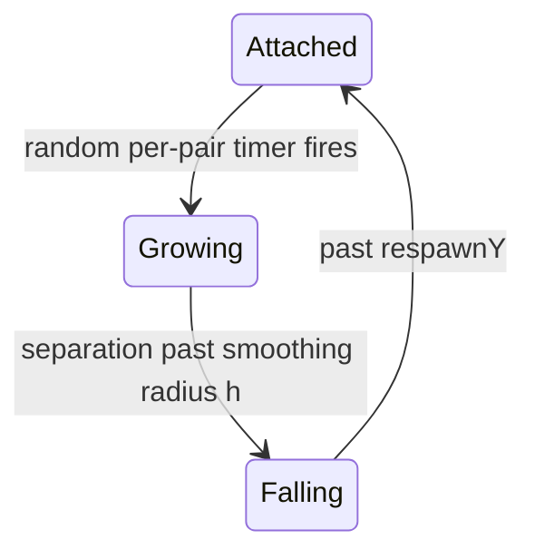
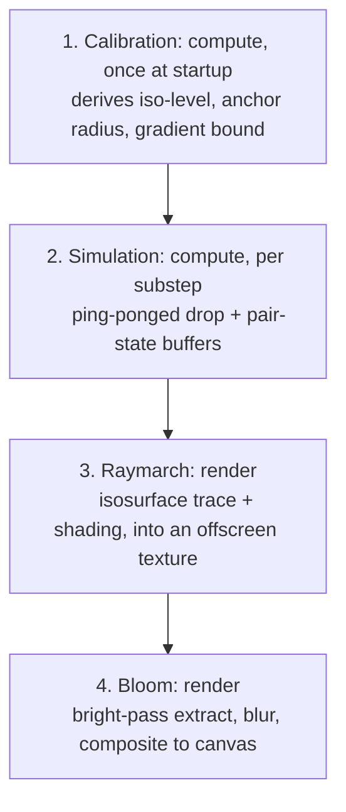

# Lava Demo

## 1. Functionality

### 1.1 Concept

Lines of hanging drops that stretch, snap, and fall, rendered as one continuous molten surface.

A **pair** is one static **anchor** plus one dynamic **drip**. Both drawn from a shared flat pool of **drops**.

The surface is never modeled explicitly, only implied: it is the isosurface of the same density field that drives the physics.

### 1.2 Phase system

**Recurring cycle**, per pair, independently timed: no synchronized wave across the line

| Phase | Meaning | Trigger for next phase |
|---|---|---|
| **Attached** | drip at rest, coincident with its anchor | per-pair random timer |
| **Growing** | cohesion + gravity, stretching the drip away from the anchor | separation past $h$ |
| **Falling** | free fall, no anchor force, no coalescing between falling drips | past `respawnY` |

**No abrupt jump between phases:** continuous cross-blend of gravity / drag at every point in time

**Emergent detachment:**
- cohesion kernel compactly supported at $h$
  - inter-body force exactly zero past that range

### 1.3 Object representation

**Combined density field**, standing in for a signed distance field, via kernel-weighted sum of masses:
- **data:** $i$: index, $\mathbf x_i(t)$: position, $r_i(t)$: radius, $\mathbf v_i(t)$: velocity

$$A(\mathbf x,t) = \sum_j m_j\,W_{\text{density}}(\mathbf x-\mathbf x_j(t),h)$$

- **object surface:** the isosurface at a calibrated threshold of $A$

$$\text{surface} = \{\mathbf x : A(\mathbf x) = \text{isoLevel}\}$$

- **calibration:** `isoLevel` set against one particle's own peak density, pairs on a line never a densely packed fluid
  - a lone drop already past `isoLevel` alone; an overlapping pair, one fused body

**Pseudo-random noise function** $\mathcal N(\mathbf x,t)$:
- **surface perturbation:** additive, producing an organic, not-perfectly-smooth surface

$$\hat A(\mathbf x,t) = A(\mathbf x,t) + \beta\cdot\mathcal N(\mathbf x,t)$$

- **shading:** the same field, sampled independently again at the hit point, coloring the surface

**Stretch anisotropy:** fast-moving drips, visually elongated along their own velocity
- a rendering-only effect, the physics itself always isotropic

### 1.4 Weighting of the phases

**Weighting function:** unnormalized Gaussian bump per phase $p\in\{\text{Attached, Growing, Falling}\}$

$$\mathcal{G}_p(t\mid\mu_p,\sigma_p^2) = \exp\!\left(-\frac{(t-\mu_p)^2}{2\sigma_p^2}\right)$$

**Normalized weights:**

$$\hat w_p(t)=\frac{\mathcal{G}_p(t\mid\mu_p,\sigma_p^2)}{\sum_{q}\mathcal{G}_q(t\mid\mu_q,\sigma_q^2)}$$

**Principle:** identical phase weights for every blended attribute (gravity, drag)

$$a(t)=\sum_p \hat w_p(t)\cdot a_p(t)$$

**Parameters:**
- $\sigma_p^2$: softness of the phase transition
- $\mu_p$: center time of the phase's bump
  - activation, on entering a phase: $\mu_p = \text{triggerTime} + l\cdot\sigma_p$, delayed onset
  - deactivation, on leaving a phase: $\mu_p = \text{triggerTime} - l\cdot\sigma_p$, already decaying at the trigger

### 1.5 Forces

**Two kernels only, no pressure / gas-constant term:**

| Kernel | Shape | Role |
|---|---|---|
| $W_{\text{density}}$ (poly6) | smooth, positive, peaks at $r=0$, zero past $h$ | the density field, shared by physics and rendering |
| $W_{\text{cohesion}}$ (Akinci) | repulsive near-field, attractive mid-range, zero past $h$ | the only inter-body force |

$$W_{\text{density}}(r,h) = \frac{315}{64\pi h^9}(h^2-r^2)^3, \quad 0\le r\le h$$

$$W_{\text{cohesion}}(r,h) = \frac{32}{\pi h^9}\begin{cases} 2(h-r)^3 r^3 - \dfrac{h^6}{64} & 0<r\le 0.5h \\[4pt] (h-r)^3 r^3 & 0.5h<r\le h \\[4pt] 0 & r>h \end{cases}$$

$$\mathbf F_{ij} = -\gamma\, m_i m_j\, W_{\text{cohesion}}(r_{ij},h)\,\frac{\mathbf x_i-\mathbf x_j}{r_{ij}}$$

**Mass:** derived from radius, $m_i=\frac43\pi r_i^3\rho_0$, never stored independently

**Integration:** explicit, semi-implicit Euler per substep
- $\mu$: a single damping rate, the only viscosity model

$$\mathbf v \leftarrow \mathbf v\,(1-\mu\,dt) + \mathbf a\,dt, \qquad \mathbf x \leftarrow \mathbf x + \mathbf v\,dt$$

- **stability:** substep size bounded by the force spike at the snap moment

### 1.6 Noise & shading

**One shared 3D value-noise fbm field**, sampled in true world space, seamless through a merge:

$$\mathcal{N}(\mathbf{x},t) = \frac{\sum_{k=0}^{K-1} a^k\, n\big(2^k(\mathbf{x} + t\,\hat{\mathbf{z}})\big)}{\sum_{k=0}^{K-1} a^k}$$

**Temperature ramp:** cooled, molten, white-hot
- white-hot deliberately past full brightness, feeding the bloom pass

$$C_{\text{temp}}(u) = \operatorname{mix}\!\Big(\operatorname{mix}(C_{\text{cool}}, C_{\text{molten}}, \operatorname{smoothstep}(0,0.6,u)),\ C_{\text{hot}},\ \operatorname{smoothstep}(0.6,1,u)\Big)$$

**Shading:** single directional light plus a Fresnel rim term
- ramp clamped for the lit term
- overshoot kept as a separate emissive term, feeding bloom independently

$$F(\mathbf v,\mathbf n) = \big(1-\operatorname{clamp}(\langle \mathbf v,\mathbf n\rangle,0,1)\big)^4
\\ C_{\text{shaded}} = \min(C_{\text{temp}},1)\cdot\operatorname{clamp}\big(\text{ambient} + \langle \mathbf n,\mathbf l\rangle + F,\ 0,\ 1\big) + \max(C_{\text{temp}}-1,\ 0)$$

### 1.7 Camera

**Scene camera:** static, no user control
- line of drops framed to fill the view, independent of window shape

$$W_L = 2\cdot d_{\text{eye}}\cdot\tan(\text{fovVertical}/2)\cdot\alpha$$

## 2. Implementation

### 2.1 Pipeline

**Technological base:** browser-based WebGPU application, raw API, no bundler, no npm dependencies, static file server

**Four GPU passes per frame:**

- **fixed-timestep accumulator:** physics decoupled from render framerate
  - render once per animation frame, regardless of substep count
- **shared command encoder:** one per frame, simulation + render + post-process together

### 2.2 Rendering technique

- **implicit definition** of the object via a density field
- **rendering** via raymarching
- **no explicit mesh geometry** besides a fullscreen triangle
- **simulation state** entirely on the GPU as storage buffers, no per-frame CPU roundtrip
- **adaptive step size**, following the local gradient
  - hit found by sign-change plus bisection

### 2.3 Module contract

**Pass construction, shared across all four passes:**
- a fixed template: uniform buffer, bind group layout, pipeline
- **variable per pass:** binding visibility, the list of buffer types, the pipeline itself
- **fixed across passes:** the template's assembly order

**Every module ends with one public-interface section:**
- helpers preceding it, grouped under category headers
- entry points named for their role

**Further conventions:**
- identical computation used twice or more: one shared helper

### 2.4 Central state management

**Phase as plain data:**
- each pair's phase packed directly into its own GPU record
- transitions computed inline by the simulation shader, every substep, for every pair independently

**Ping-pong buffers**, swapped once per substep:
- drop state and pair (phase) state, both built from the same low-level buffer pattern
- **anchor state, the exception:** a single, non-ping-ponged buffer, seeded once

### 2.5 GPU infrastructure

**Generic building blocks, reused identically across all four passes:**
- uniform buffer creation and write
- bind group layout from a plain list of buffer types
- bind group from a uniform buffer plus a plain list of storage buffers
- fullscreen draw / compute dispatch, factored out of each pass's own loop
- the same buffer-list pattern, mirrored for the bloom pass's texture-and-sampler bind groups

### 2.6 Shader composition

**WGSL chunk injection:**
- chunks: parameterized template strings, spliced into full shader sources
- **chunk vs. shader boundary:**
  - a chunk: pure, parameterized computation only
  - a shader: anything touching a uniform or storage binding
- a piece shared across shader files (the fullscreen-triangle vertex position), kept once in `shaderChunks/`

**Shared constants:**
- `src/constants.js`: single source for constants used in **more than one** JS module
- constants used only once: kept local to their consumer
- WGSL-side constants: local literals inside their own chunk, not sourced from JS
